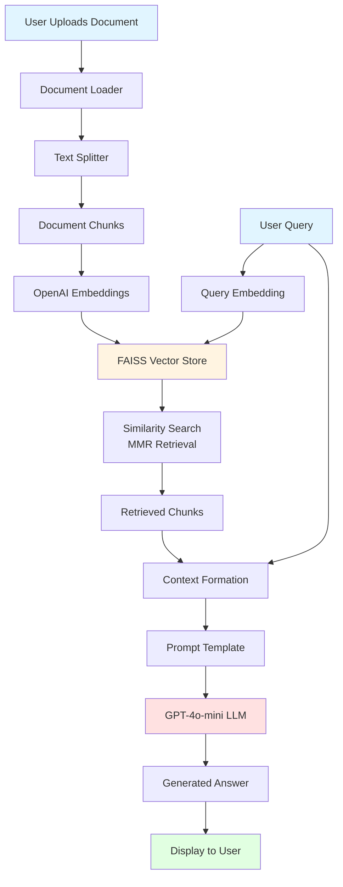

# GenAI RAG Application 🤖📚

A Retrieval-Augmented Generation (RAG) application built with LangChain and Streamlit that allows users to chat with their documents using AI-powered question answering.

## 📋 Table of Contents

- [Overview](#overview)
- [RAG Architecture](#rag-architecture)
- [Features](#features)
- [Installation](#installation)
- [Usage](#usage)
- [Project Structure](#project-structure)
- [Technologies Used](#technologies-used)
- [Configuration](#configuration)
- [How It Works](#how-it-works)
- [Contributing](#contributing)

## 🎯 Overview

This RAG application enables users to upload documents and ask questions about their content. The system uses advanced natural language processing to retrieve relevant information from the documents and generate accurate, context-aware answers using OpenAI's GPT-4o-mini model.

## 🔄 RAG Architecture



### RAG Process Flow

1. **Document Ingestion**: Upload and load documents using UnstructuredFileLoader
2. **Text Chunking**: Split documents into manageable chunks (1000 chars with 200 overlap)
3. **Embedding Generation**: Convert text chunks into vector embeddings using OpenAI
4. **Vector Storage**: Store embeddings in FAISS vector database for efficient retrieval
5. **Query Processing**: Convert user questions into embeddings
6. **Retrieval**: Find most relevant chunks using MMR (Maximum Marginal Relevance) search
7. **Context Building**: Aggregate retrieved chunks to form context
8. **Answer Generation**: LLM generates answers based on retrieved context
9. **Response Delivery**: Present the answer to the user

## ✨ Features

- **📁 Multi-Format Support**: Upload various document formats (TXT, PDF, DOCX, etc.)
- **🧠 Intelligent Retrieval**: Uses MMR algorithm for diverse and relevant results
- **💬 Conversational Interface**: Clean, intuitive Streamlit UI
- **🎯 Context-Aware Answers**: Responds only based on document content
- **⚡ Fast Processing**: Efficient vector similarity search with FAISS
- **🔒 Secure**: Uses environment variables for API key management

## 🚀 Installation

### Prerequisites

- Python 3.8 or higher
- OpenAI API key

### Setup Steps

1. **Clone the repository**
   ```bash
   git clone https://github.com/yourusername/GenAI_RAG.git
   cd GenAI_RAG
   ```

2. **Create a virtual environment** (recommended)
   ```bash
   python -m venv venv
   source venv/bin/activate  # On Windows: venv\Scripts\activate
   ```

3. **Install dependencies**
   ```bash
   pip install -r requirements.txt
   ```

4. **Set up environment variables**
   
   Create a `.env` file in the project root:
   ```env
   OPENAI_API_KEY=your_openai_api_key_here
   ```

## 💻 Usage

1. **Run the application**
   ```bash
   streamlit run GenAI_RAG_application.py
   ```

2. **Upload your document**
   - Click on "Upload Your File" button
   - Select a document from your computer

3. **Ask questions**
   - Once the document is processed, enter your question in the text input
   - The AI will analyze the document and provide relevant answers

## 📁 Project Structure

```
GenAI_RAG/
│
├── GenAI_RAG_application.py    # Main Streamlit application
├── requirements.txt             # Python dependencies
├── .env                        # Environment variables (API keys)
├── Abdul_Kalam_Biography.txt   # Sample document
└── README.md                   # Project documentation
```

## 🛠️ Technologies Used

| Technology | Purpose |
|------------|---------|
| **LangChain** | Framework for building LLM applications |
| **OpenAI GPT-4o-mini** | Large Language Model for answer generation |
| **OpenAI Embeddings** | Text embedding for semantic search |
| **FAISS** | Vector database for efficient similarity search |
| **Streamlit** | Web application framework |
| **Python-dotenv** | Environment variable management |
| **UnstructuredFileLoader** | Multi-format document loading |

## ⚙️ Configuration

### Text Splitting Parameters

```python
chunk_size = 1000        # Characters per chunk
chunk_overlap = 200      # Overlap between chunks
```

### Retrieval Parameters

```python
search_type = "mmr"              # Maximum Marginal Relevance
k = 5                            # Number of chunks to retrieve
lambda_mult = 0.4                # Diversity factor (0=diverse, 1=similar)
```

### LLM Model

```python
model = "gpt-4o-mini"            # OpenAI model
```

## 🔍 How It Works

### 1. Document Processing

When you upload a document:
- The file is saved temporarily
- UnstructuredFileLoader reads and parses the content
- RecursiveCharacterTextSplitter divides it into chunks
- Each chunk is converted to embeddings using OpenAI
- Embeddings are stored in FAISS vector database

### 2. Question Answering

When you ask a question:
- Your question is converted to an embedding
- FAISS performs similarity search using MMR algorithm
- Top 5 most relevant chunks are retrieved
- Retrieved context is passed to GPT-4o-mini with your question
- The model generates an answer based only on the provided context

### 3. MMR Retrieval Strategy

Maximum Marginal Relevance balances:
- **Relevance**: How well chunks match your query
- **Diversity**: Ensuring varied information coverage

This prevents redundant results and provides comprehensive answers.

## 🤝 Contributing

Contributions are welcome! Here's how you can help:

1. Fork the repository
2. Create a feature branch (`git checkout -b feature/AmazingFeature`)
3. Commit your changes (`git commit -m 'Add some AmazingFeature'`)
4. Push to the branch (`git push origin feature/AmazingFeature`)
5. Open a Pull Request

## 📝 Future Enhancements

- [ ] Add support for multiple document uploads
- [ ] Implement conversation history/memory
- [ ] Add citation sources in answers
- [ ] Support for more LLM providers (Anthropic, Google, etc.)
- [ ] Add document preprocessing options
- [ ] Implement user authentication
- [ ] Add export functionality for Q&A sessions

## 🐛 Troubleshooting

### Common Issues

**Issue**: "OpenAI API key not found"
- **Solution**: Ensure `.env` file exists with valid `OPENAI_API_KEY`

**Issue**: "Module not found"
- **Solution**: Install all dependencies: `pip install -r requirements.txt`

**Issue**: "Document processing fails"
- **Solution**: Check file format compatibility and encoding

## 📄 License

This project is open source and available under the MIT License.

## 👨‍💻 Author

**Your Name**
- GitHub: [@yourusername](https://github.com/yourusername)
- Email: your.email@example.com

## 🙏 Acknowledgments

- LangChain team for the excellent framework
- OpenAI for powerful language models
- Streamlit for the intuitive UI framework
- FAISS for efficient vector search capabilities

---

⭐ If you find this project useful, please consider giving it a star on GitHub!
